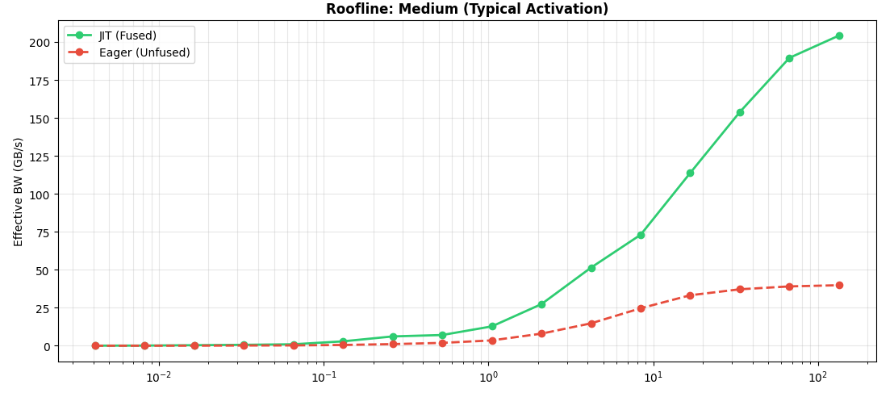

# ML Compiler Mechanics: From Graph to Silicon

## Mission
Modern machine learning frameworks excel at abstraction, allowing engineers to define complex architectures without worrying about memory alignment or kernel fusion. However, deploying efficient models on specialized hardware—like Tensor SOCs—requires piercing this veil of abstraction.

This repository is a collection of interactive case studies designed to bridge the gap between high-level model design and low-level system performance. It explores the "hardware-software contract," demonstrating how compiler decisions (like XLA fusion) and arithmetic precision (quantization) directly impact latency, throughput, and memory bandwidth.

## Why This Matters
For ML practitioners and systems engineers, understanding these mechanics is no longer optional. As models grow larger and compute budgets tighter, the ability to reason about **arithmetic intensity**, **memory hierarchies**, and **compiler IR** becomes the primary lever for optimization.

## Modules

<table>
  <tr>
    <td width="60%" valign="top">
      <h3>1. The Operator Fusion Advantage (XLA/JAX)</h3>
      <ul>
        <li><b>Focus:</b> Graph-Level Optimization & Memory Bandwidth.</li>
        <li><b>Concept:</b> Analysis of how the XLA compiler fuses element-wise operations (like GELU or Swish) into single kernels to reduce HBM access penalties.</li>
        <li><b>Key Artifact:</b> Roofline analysis comparing Eager Execution vs. XLA JIT.</li>
      </ul>
    </td>
    <td width="40%" valign="top">
       
      
      <b>Eager Execution (Red)</b> collapses on medium-complexity workloads, while <b>JIT (Green)</b> saturates the hardware bandwidth
    </td>
  </tr>

  <tr>
    <td width="60%" valign="top">
      <h3>2. Quantization & Precision (TFLite)</h3>
      <ul>
        <li><b>Focus:</b> Arithmetic Efficiency & Model Footprint.</li>
        <li><b>Concept:</b> A comparative study of FP32 vs. INT8 execution. This module explores how reducing precision impacts model size and enables the usage of high-throughput integer pipelines on NPU architectures.</li>
        <li><b>Key Artifact:</b> Latency and size benchmarks on standard vision backbones.</li>
      </ul>
    </td>
    <td width="40%" valign="center" align="center">
      <i>[Visual Benchmark Coming Soon]</i>
    </td>
  </tr>

  <tr>
    <td width="60%" valign="top">
      <h3>3. Future Roadmap (Planned)</h3>
      <ul>
        <li><b>Memory Layouts:</b> Investigating the impact of NHWC vs. NCHW formats on vectorization efficiency.</li>
        <li><b>Sparsity:</b> Techniques for exploiting zero-weight structures to skip compute cycles.</li>
        <li><b>Custom Kernels:</b> Introduction to writing custom ops when the compiler cannot infer the optimal path.</li>
      </ul>
    </td>
    <td width="40%" valign="center" align="center">
      <i>[Concept Diagram Coming Soon]</i>
    </td>
  </tr>
</table>