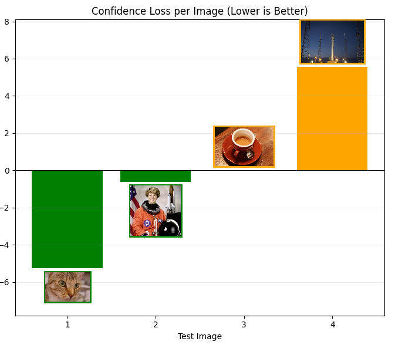
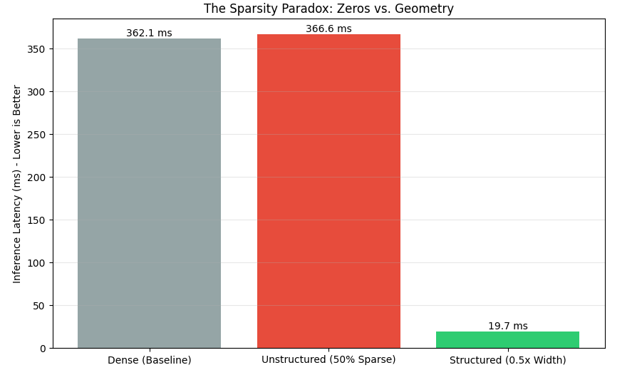

# ML Compiler Mechanics: From Graph to Silicon

## Mission
Modern machine learning frameworks excel at abstraction, allowing engineers to define complex architectures without worrying about memory alignment or kernel fusion. However, deploying efficient models on specialized hardware—like Tensor SOCs—requires piercing this veil of abstraction.

This repository is a collection of interactive case studies designed to bridge the gap between high-level model design and low-level system performance. It explores the "hardware-software contract," demonstrating how compiler decisions (like XLA fusion) and arithmetic precision (quantization) directly impact latency, throughput, and memory bandwidth.

## Why This Matters
For ML practitioners and systems engineers, understanding these mechanics is no longer optional. As models grow larger and compute budgets tighter, the ability to reason about **arithmetic intensity**, **memory hierarchies**, and **compiler IR** becomes the primary lever for optimization.

## Modules

<table>
  <thead>
    <tr>
      <th width="20%">Key Artifact</th>
      <th width="80%">Module Description</th>
    </tr>
  </thead>
  
  <tr>
    <td align="center">
      
    </td>
    <td valign="top">
      <h3><a href="notebooks/01_fusion/01_fusion.ipynb">1. The Operator Fusion Advantage (XLA/JAX)</a></h3>
      
<b>Focus:</b> Graph-Level Optimization & Memory Bandwidth.

      
Analysis of how the XLA compiler fuses element-wise operations (like GELU) into single kernels to reduce HBM access penalties. <i>(Comparing Eager Execution vs. XLA JIT)</i>.

    </td>
  </tr>

  <tr>
    <td align="center">
      
    </td>
    <td valign="top">
      <h3><a href="notebooks/02_quantization/02_quantization_and_precision.ipynb">2. Quantization & Precision (TFLite)</a></h3>
      
<b>Focus:</b> Arithmetic Efficiency & Model Footprint.

      
A comparative study of FP32 vs. INT8 execution. Showcases how reducing precision impacts model size (4x reduction) and enables high-throughput integer pipelines.

    </td>
  </tr>

  <tr>
    <td align="center">
      
    </td>
    <td valign="top">
      <h3><a href="notebooks/03_sparsity/03_pruning_and_sparsity.ipynb">3. Pruning & The Sparsity Paradox</a></h3>
      
<b>Focus:</b> Execution Efficiency vs. Theoretical FLOPs.

      
A counter-intuitive benchmark demonstrating that Unstructured Pruning (masking) yields zero speedup. Real gains require modifying tensor geometry (Structured Pruning).

    </td>
  </tr>

  <tr>
    <td align="center">
      
    </td>
    <td valign="top">
      <h3><a href="notebooks/04_sensitivity/04_sensitivity_analysis.ipynb">4. Layer Sensitivity Analysis</a></h3>
      
<b>Focus:</b> Mixed-Precision Quantization Strategy.

      
A "sensitivity scan" identifies sensitive layers (require INT8) vs. more robust layers (safe for INT4), creating an optimal mixed-precision policy.

    </td>
  </tr>

  <tr>
    <td align="center">
      
    </td>
    <td valign="top">
      <h3><a href="notebooks/05_qat/05_qat_from_scratch.ipynb">5. Quantization Aware Training (QAT)</a></h3>
      
<b>Focus:</b> Training Dynamics & The Straight Through Estimator.

      
Implementing the "Straight Through Estimator" (STE) to train 4-bit models from scratch, recovering accuracy where standard Post-Training Quantization fails.

    </td>
  </tr>

  <tr>
    <td align="center">
      <i>Coming Soon</i>
    </td>
    <td valign="top">
      <h3>6. Future Roadmap: Custom Kernels</h3>
      
Writing OpenAI Triton kernels to bypass compiler limitations and execute INT4 operations efficiently on GPU.

    </td>
  </tr>
</table>