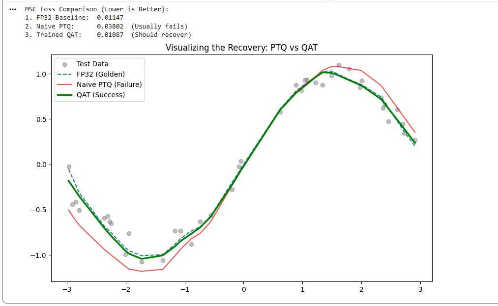

# Quantization Aware Training (QAT)

This notebook solves the "Sensitive Layer" problem we found in the previous module.

Sometimes, a layer is just too fragile to be quantized after training. If you force it to 4-bit (INT4), the accuracy collapses. This is where **Quantization Aware Training (QAT)** comes in.

Instead of training in high precision and *hoping* the weights survive quantization later, we simulate the quantization damage **during training**. This forces the network to learn weights that remain accurate even when rounded to the nearest integer.

### The Engineering Challenge: The Vanishing Gradient
We can't just add `x = round(x)` to our PyTorch training loop.
* The derivative of `round()` is **zero** almost everywhere.
* If gradients are zero, backpropagation stops, and the model learns nothing.
Fundamentally, the problem is that backprop requires differentiability, and quantization is intrinsically non-differentiable since it assigns continuous values to discrete buckets.

**The Solution: The Straight Through Estimator (STE)**
We implement the industry-standard "hack" to bypass this:
1.  **Forward Pass:** We apply the rounding so the loss function "feels" the noise.
2.  **Backward Pass:** We pretend that the quant operations didn't happen when we compute the gradient.
That assymetry of forward/backward passes allows us to efficiently perform a form of gradient descent where the model learns to adapt to the quantization operations.
 
### The Experiment
We set up a challenging regression task (fitting a noisy sine wave) and compare three models:
1.  **FP32 Baseline:** Standard training.
2.  **Naive PTQ:** We take the FP32 model and aggressively reduce precision to INT4.
3.  **QAT:** We train from scratch using our custom `STEQuantize` autograd function.

### The Results (Visualized)
The difference is super compelling.

**How to read the graph:**
* **Red Line (PTQ):** This represents the "Naive" approach. The model was optimized for high precision, so when we round the weights, the predictions fly off the rails.
* **Green Line (QAT):** Even though this model is *also* using 4-bit weights, it tracks the sine wave perfectly. Because it "practiced" with rounding noise during training, it learned to be robust against it.

### TL;DR
* **PTQ vs QAT:** Use Post-Training Quantization (PTQ) for 8-bit. Use QAT for 4-bit or lower.
* **The "Lie" works:** The Straight Through Estimator is mathematically "wrong" (the gradients don't match the forward pass), but in Deep Learning, it works surprisingly well.

### Quick Start
1.  **Pure PyTorch:** No external libraries (like TensorFlow Lite) are needed. We build the autograd function from scratch so you can see exactly how the math works.
2.  **Run All:** The notebook trains both models in under a minute on a standard CPU or GPU.
